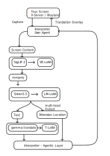

yaInterpreter
===========

Yet another interpreter

**currently under active early-stage development.**

Introduction
----------------

I'm constructing a translation software, similar to the project interpreter, but re-designed from the ground up for complex, real-world visual environments (such as 3D game screens, dynamic overlays, and stylized media).

Currently, the origin project interpreter (as well as other desktop overlay translation tools) have many limitations:

* **Spatial & Perspective Blindness**: Most existing tools rely on standard, rigid OCR engines. They assume the text is flat, structured, and horizontal. Once introduced to 3D game environments (e.g., dynamic VR worlds, arcade rhythm game UI like CHUNITHM/maimai), angled perspective warp, camera distortion, and dynamic lighting cause traditional OCR to instantly fail.
* **Contextual Disconnect**: Standard interpreters isolate text recognition from translation. They pass fragmented, misordered character streams into a translation API, completely destroying CJKV grammar structures and context, resulting in machine-translated gibberish.
* **Monolithic Inflexibility**: They lack an adaptable mathematical interface to "bridge" raw geometric pixels directly into advan
yaInterpreter.
* **Language Support**: Interpreter only support Japanese to English translate.

### The Re-designed Approach

`yaInterpreter` abandons the traditional "OCR + Translation API" pipeline. Instead, it utilizes an end-to-end, multi-stage **Multimodal Causal LLM Framework paired with an Agentic Layer** running natively on Linux (X11/Wayland).

System Architecture
----------------

The entire processing pipeline forms a highly cohesive reactive loop:

### Core Pipeline Breakdown

1. **Perceptual Capture & Encoding**: The `User Agent` intercepts raw pixels from the X-Server/Wayland display server. The image stream is fragmented by **SigLIP 2**, fine-tuned with **VE-LoRA** to maintain robustness against extreme geometric distortion and noise.
2. **Vision-Language Bridging (`mmproj`)**: A projection matrix smuggles the visual token embeddings into the text embedding space, allowing the language model to "see" spatial environments.
3. **Multi-Head Structure Extraction**: **Qwen3.5** (boosted by **LM-LoRA**) decodes the aligned visual tokens simultaneously into two parallel streams:
* **Text Stream**: The raw character layout in its original contextual grammar.
* **Attention Location Stream**: Deep bounding coordinates extracted from the self-attention heads, charting exactly *where* the text sits in 3D space.

4. **Context-Aware Translation**: The extracted text stream is passed directly to an independent translation engine (**gemma-translate + T-LoRA**) to reconstruct natural, precise localized results without structural erosion.
5. **Agentic Overlay Rendering**: The **Agentic Layer** unifies the translated text stream with the attention location coordinate matrix, rendering a perfectly stabilized, anti-warped `Translation Overlay` back onto the host screen in real-time.

Process
===========

1. Tranning mmproj for connection between `siglip2-base-patch16-384 and Qwen3.5-4B`
